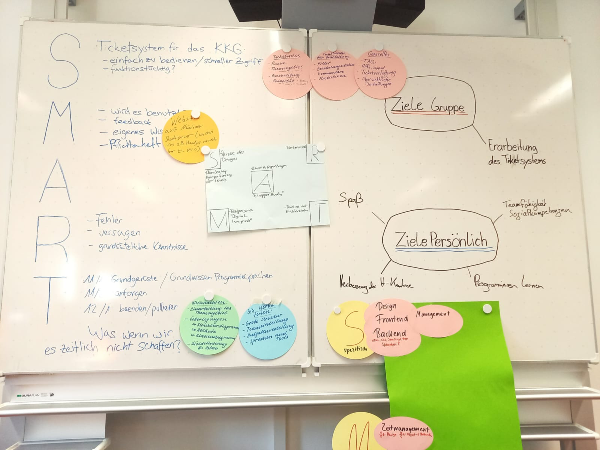

# Ticketsytem

Git und GitHub Tutorials:

- [Git It? How to use Git and Github (kurz)](https://www.youtube.com/watch?v=HkdAHXoRtos)
- [Git Tutorial for Beginners - Git & GitHub Fundamentals In Depth (etwas länger)](https://www.youtube.com/watch?v=DVRQoVRzMIY)
- [Git and GitHub for Beginners - Crash Course (etwas länger)](https://www.youtube.com/watch?v=RGOj5yH7evk)

